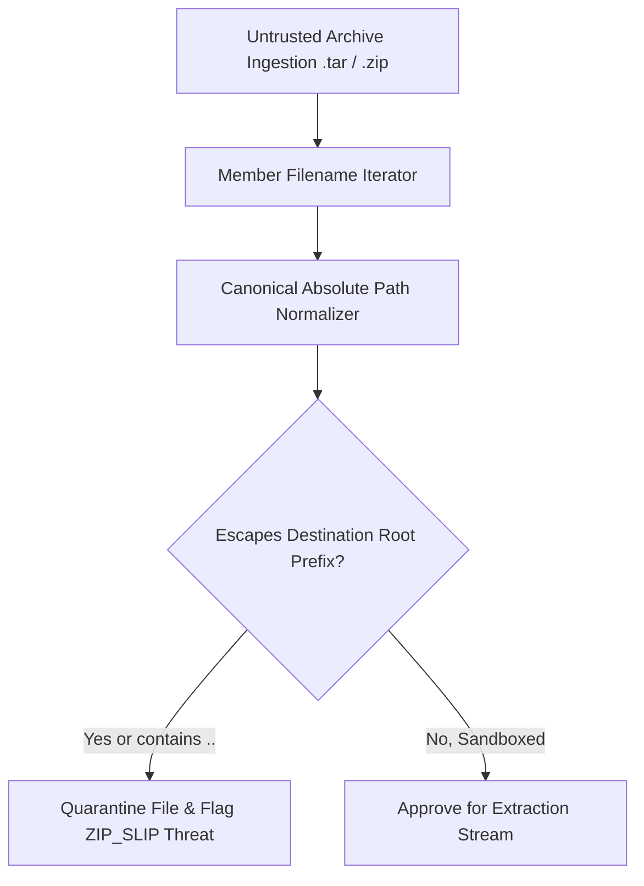

# GenPark AI Agent Skill - Tar Archive Path Traversal Slip Sanitizer

Neutralizes `Zip Slip` and `Tar Slip` path traversal directory escape attacks when extracting untrusted packages.

Verified by [GenPark AI](https://genpark.ai) and compatible with [Model Context Protocol (MCP)](https://genpark.ai/mcp).

## Architecture Diagram

## Features
- **Hermetic Destination Anchor**: Guarantees no file is written outside the allocated sandbox boundary.
- **Zero External Dependencies**: Pure Python 3.9+ standard library.
